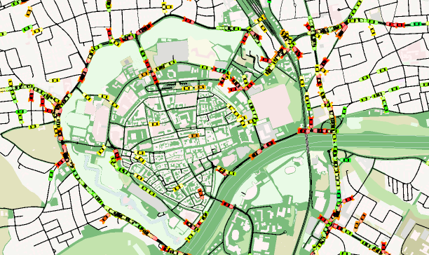

# Multimodal Traffic simulation of Ingolstadt in SUMO

### Created in the SAVe:, SAVeNoW and KIVI research projects

## Getting started

To run the simulation you need to download Eclipse SUMO (Simulation of Urban Mobility) from [eclipse](https://www.eclipse.org/sumo/) or [github](https://github.com/eclipse/sumo). The provided simulation was developed and tested with SUMO 1.19.0.

After cloning, you can run the simulation by running the config file **simulation/24h_sim.sumocfg**.

If the simulation is slow, try removing the polygons from the config file.

## Simulation setup

The 24h simulation currently contains routes for passenger vehicles, heavy-vehicle traffic as well as bicycles. Both vehicle demand as well as traffic light settings are created from data for Wednesday the 16.09.2020 to create a weekday traffic situation mostly uninfluenced by covid-restrictions. More details on the simulation setup are provided in [simulation_setup](docs/simulation_setup.md) and in the listed publications.

Please note that while there are sidewalks on several streets the network *should not* be used for pedestrian simulation.
There are crossings missing in several places, making it disconnected.

Furthermore you should always load the WAUT mentioned in the config file because the default traffic lights are not working correctly.

## Simulation for Multiple Days

In general, the model can be calibrated for any day between 08/2019 and 12/2023. For demonstration purposes, the traffic has been calibrated for 9 days representing 3 Mondays, Tuesdays and Sundays in summer 2023. For these days also public transport routes are available.
You can start the simulation of each day by running the corresponding sumocfg-file.

## Contributing

The simulation was created to provide a realistic multi-modal environment for traffic research. The model is under continuous development and issue reports and contributions are greatly appreciated. Feel free to get in touch with us by opening an [issue](https://github.com/TUM-VT/sumo_ingolstadt/issues) in the repository.

## Research

When using the simulation in your research, feel free to cite this publication describing the simulation setup.

Michael Harth, Marcel Langer and Klaus Bogenberger, Automated Calibration of Traffic Demand and Traffic Lights in SUMO Using Real-World Observations, *SUMO Conference Proceedings*, 2021, https://doi.org/10.52825/scp.v2i.120

The calibration of driver-behavior based on real-world vehicle trajectories is presented in:

Marcel Langer, Michael Harth, Lena Preitschaft, Ronald Kates and Klaus Bogenberger, Calibration and Assessment of Urban Microscopic Traffic Simulation as an Environment for Testing of Automated Driving, *IEEE Intelligent Transportation Systems Conference*, 2021, DOI: 10.1109/ITSC48978.2021.9564743

The Multi-Day Simulation of Multimodal Traffic has been presented with a poster at SUMO User Conference 2024.

## Acknowledgements

* Thank you to [Lutz Morich](https://www.linkedin.com/in/lutz-morich-in/) of Audi and [Prof. Klaus Bogenberger](https://www.mos.ed.tum.de/vt/mitarbeiter-innen/univ-prof-dr-ing-klaus-bogenberger/) of TUM for providing the working environment and making this work possible.
* We appreciate the funding of the [SAVe:](https://save-in.digital/) and [KIVI](https://www.bmvi.de/SharedDocs/DE/Artikel/DG/KI-Projekte/kivi-kuenstliche-intelligenz-im-verkehrssystem-ingolstadts.html) research projects by [BMVI](https://www.bmvi.de/DE/Home/home.html) as well as the funding for the [SAVeNoW](https://www.bmvi.de/SharedDocs/DE/Artikel/DG/AVF-projekte/savenow.html) research project by [BMWi](https://www.bmwi.de/Navigation/DE/Home/home.html).
* Initial setup by [Marcel Langer](https://www.linkedin.com/in/marcel-langer-18b3a4175/) and [Michael Harth](https://www.linkedin.com/in/michael-harth-916130145/).
* Continuous improvements by [Natalie Sautter](https://www.mos.ed.tum.de/vt/mitarbeiter-innen/sautter-natalie/), [Martin Margreiter](https://www.mos.ed.tum.de/vt/mitarbeiter-innen/margreiter-martin/) and [Mario Ilic](https://www.mos.ed.tum.de/vt/mitarbeiter-innen/ilic-mario/) in the SAVeNoW and KIVI Projects.
* Public Transport Integration and Multi-Day Simulation created by [Joel Brodersen](https://de.linkedin.com/in/joel-brodersen-0b1799205)
* Special thanks to all who supported to project over the years including Philipp Neuhaus, Lena Preitschaft, Philipp Wulff, Navneet Singh Dhir, Camilo Cardona Torres and Danil Belikhov.

## Licence

The simulation is distributed by AUDI AG and the Chair of Traffic Engineering and Control of the Technical University of Munich under the Apache License Version 2.0. SUMO is available as open source under the Eclipse Public License 2.0. For more detailled information check [LICENSE](LICENSE.md). 
